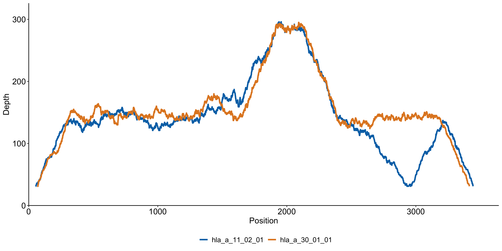
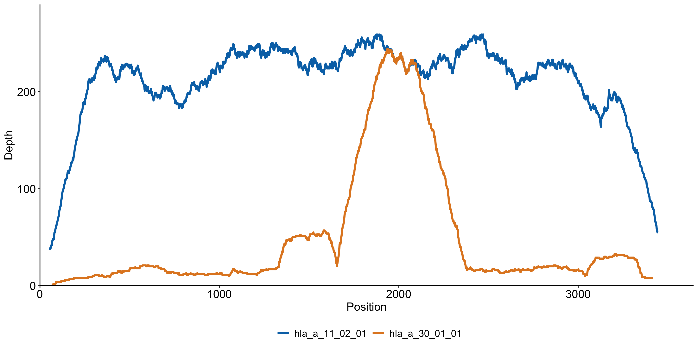
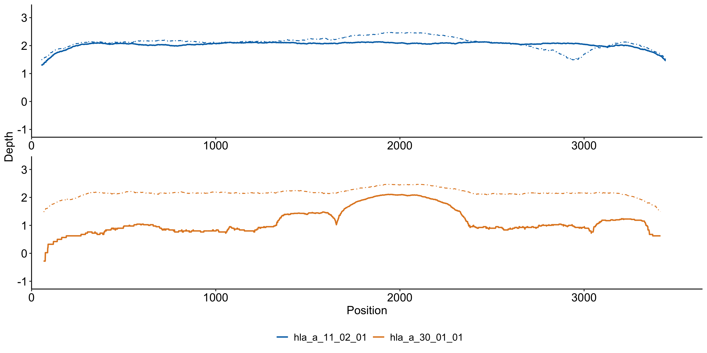
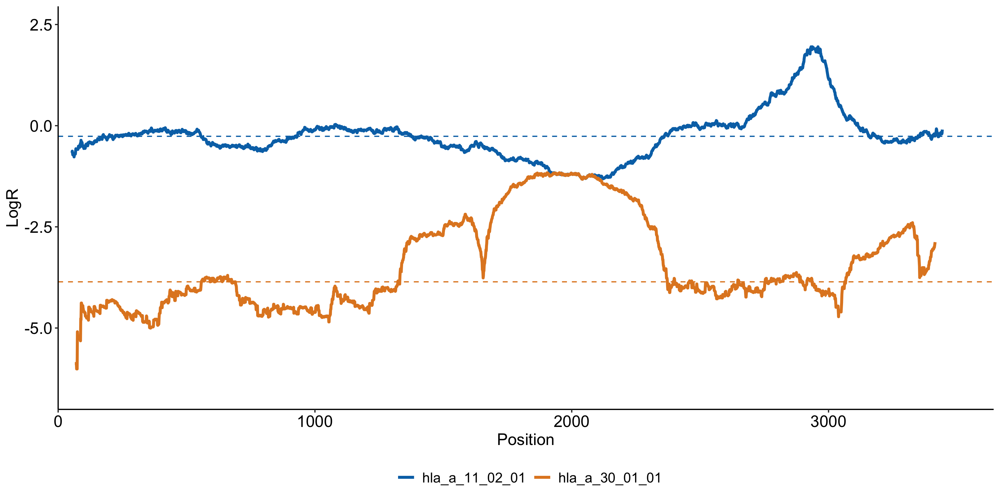
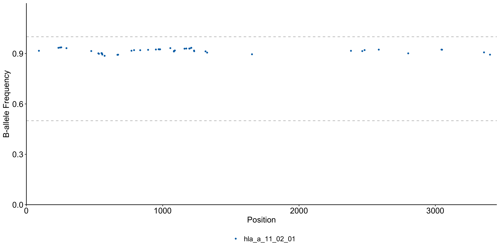

# lohhla Modern

`lohhlamod` is the original [lohhla](https://doi.org/10.1016/j.cell.2017.10.001) HLA loss of heterozygosity detection algorithm re-engineered in modern style.  

## Installation

Please refer to [INSATLL](INSTALL.md) for details.

## Command line

```
usage: lohhlamod
       [-h] --subject STR --tbam FILE --nbam FILE --hlaref FILE
       [--tstates FILE] --outdir DIR [--min_cov INT] [--min_necnt INT]
       [--threads INT]

options:
  -h, --help       show this help message and exit
  --subject STR    Specify the subject ID
  --tbam FILE      Specify the tumor bam file
  --nbam FILE      Specify the normal bam file
  --hlaref FILE    Specify HLA reference sequence
  --tstates FILE   Specify file includeing tumor purity and ploidy
  --outdir DIR     Specify the output directory
  --min_cov INT    Specify the minimum coverage at mismatch sites (30)
  --min_necnt INT  Specify the minimum number of diff events allowed for reads
                   mapping to HLA alleles (1)
  --threads INT    Specify the number of threads (16)
```

## Prepare Input

### BAM

`lohhlamod` does not do realignment like the original `lohhla` program. To get the required BAMs, you can use [polysolverMod](https://github.com/svm-zhang/polysolverMod), another re-engineered HLA typing tool based on `polysolver`.

To get BAM for normal sample, you can simply follow the [example](https://github.com/svm-zhang/polysolverMod?tab=readme-ov-file#quick-start) and swap with your data. `polysolverMod` generates the realigned BAM with suffix `ready.bam`, that is ready for detecting LOH.

Please follow this [guide](https://github.com/svm-zhang/polysolverMod?tab=readme-ov-file#scenario-detecting-loh-from-paired-tumor-and-normal-samples) specifically for getting realigned-BAM for tumor sample. 

### HLA reference

This refers to the sample-level HLA reference with specific typed alleles for the sample. The reference file is available after you successfully run `polysolverMod` on the normal sample.


### Estimated tumor ploidy and purity (--tstates)

`lohhlamod` uses estimated ploidy and purity for inferring allelic copy number. Ploidy and purity estimates can be obtained from many CNV algorithms. In cases where there is no paired normal sample or reference panel available such that you cannot get the estimates, `lohhlamod` allows this option to be optional by using a default value of `ploidy = 2` and `purity = 0.5`. The default values have not made customizable from command line at the moment.

An example of the file provided to `--tstates` looks like below:

| SampleID | TumorPloidy | TumorPurityNGS |
| -------- | ----------- | -------------- |
|   s1_t   |     2.33    |        1       |


## Explain Output

`lohhlamod` dumps all results under output specified by `--outdir`.

* `*.filt.bam`: filtered alignment result by minimum allowed mismatch events specified by `--min_ecnt` option. The filtered BAM files are used for the final LOH detection
* `$subject.loh.res.tsv`: LOH main result, each row per allele (see below for column schema)
* `*.rds`: serialized file with intermediate data tables, one per allele. These `rds` files are used for getting plots by running `lohhlaplot` command. 

The columns in the LOH result are defined as follows:
* `HLA_A1_CN`: estimated copy number (CN) for allele 1, the upper and lower estimates are named with `Upper` and `Lower` suffix
* `HLA_A2_CN`: estimated CN for allele 2
* `Pct_CN_Diff_Supporting_Bins`: percentage of bins supporting a significant CN difference b/w allele 1 and 2
* `HLA_A1_Median_LogR`: median estimates of log-ratio of tumor versus normal for allele 1
* `HLA_A2_Median_LogR`: same as above but for allele 2
* `HLA_A1_MM_Median_LogR`: median estiamtes of log-ratio of tumor versus normal at mismatch sites for allele 1
* `HLA_A2_MM_Median_LogR`: same as above but for allele 2
* `MM_LogR_Paired_Pvalue`: p-value from paired test for log-ratio difference b/w 2 alleles at mismatch sites
* `Median_BAF`: median estimate of b-allele frequency across mismatch sites
* `Num_MM`: number of mismatches b/w 2 alleles
* `Num_Bins`: total number of bins of size 150bp across the pairwise alignment b/w 2 alleles
* `Num_MM_Bins`: number of bins with mismatch sites
* `Pct_A1_Loss_Supporting_Bins`: percentage of bins supporting a significant CN loss for allele 1
* `Pct_A2_Loss_Supporting_Bins`: same as above but for allele 2
* `HLAGene`: HLA gene locus
* `HLA_A1`: allele 1
* `HLA_A2`: allele 2

## Visualize Coverage, LogR, and BAF
`lohhlamod` provides a command `lohhlaplot` to generate a set of plots per HLA gene. `lohhlaplot` uses the `rds` files as backend data for visualization. To get the plots provided by this package, simply run:

```
lohhlaplot --sample "$subject" \
    --loh_res "$loh_res_file" \
    --loh_dir "$loh_outdir"
```

The command above creates a sub-folder within the `--loh_dir` folder. Each HLA gene gets a set of plots:
1. coverage distribution across the entire length of allele 1 and 2 in the normal sample

2. coverage distribution across the entire length of allele 1 and 2 in the tumor sample

3. paired tumor and normal coverage distribution in log10 scale across the entire length of allele 1 and 2. Tumor coverage in this plot is corrected for tumor and normal depth difference. This plot should inform you whether or not there is a LOH event occurring in one of the alleles.

4. distribution of log-ratio of tumor versus normal across entire length of allele 1 and 2. The dashed line represents median estimate of logR for each allele

5. distribution of BAF


## Simulation data

I provided a few _in silico_ datasets to mimic certain scenarios. But it is important to note that these are idealized datasets that provide guidance only. Please refer to the [README](./simulation/README.md) for more details.

## Original lohhla test data

The original example data from the `lohhla` algorithm is also available in this repo. I used `polysolvermod` to get the BAM files and HLA reference. Then `lohhlamod` was used to generate the LOH result. You can use this data to test `lohhlamod` prior to running on your own data. Note that there is LOH result for HLA-A gene as it is the only HLA gene provided in the example.

## Key differences from the OG lohhla algorithm


## Disclaimer

I, by no means, try to overtake the origianl idea and implementation of `lohhla` algorithm. This repo opens to all non-commercial researchers and projects. My mere purpose is to make it more accessible to the community based on the exprience I had in the past years.

## Citation

Please cite the original [lohhla](https://doi.org/10.1016/j.cell.2017.10.001) paper.

If you use `lohhlamod`, please kindly cite this github repo as well.