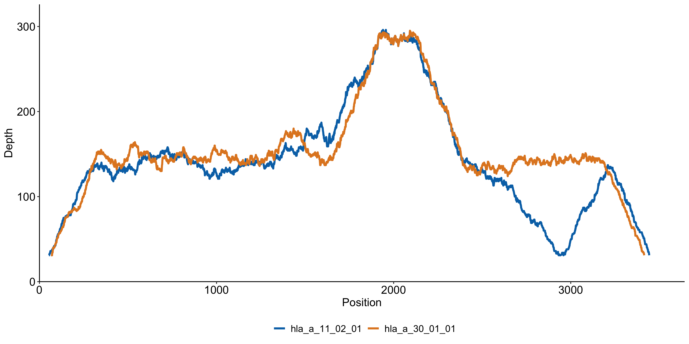
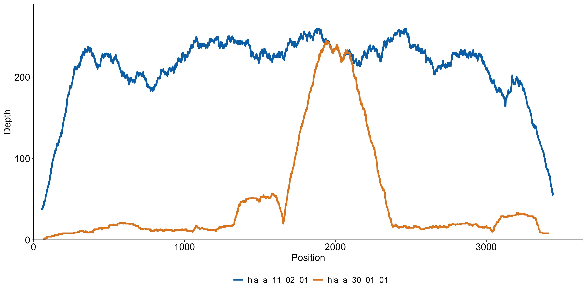
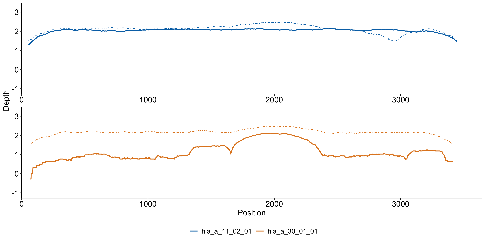
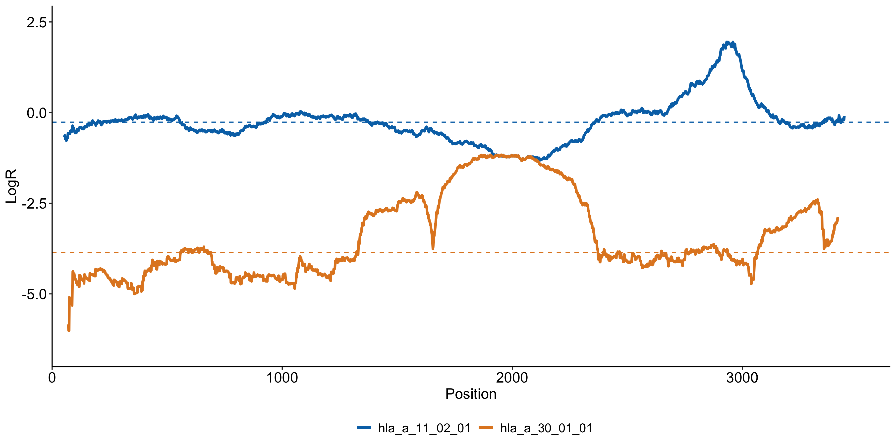
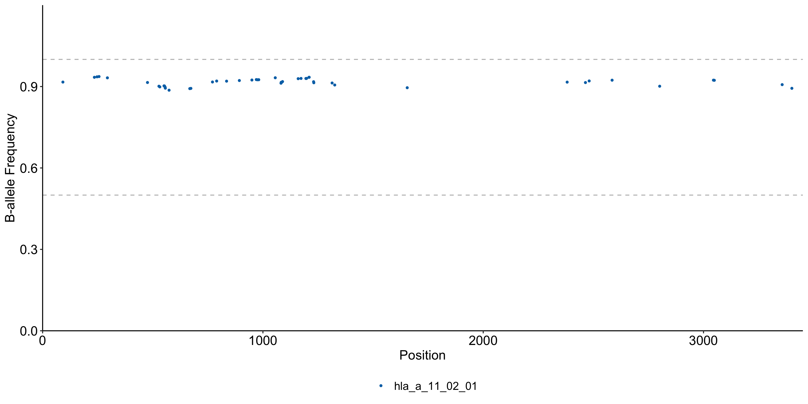

# Visualize Coverage, LogR, and BAF

## Overview

`lohhlamod` includes a dedicated visualization tool, lohhlaplot, to generate
diagnostic plots for result interpretation. `lohhlaplot` utilizes the `.rds`
files as the data backend to reconstruct the allelic landscape.

### Quick example

```bash
lohhlaplot --sample "$subject" --loh_res "$loh_res_file" --loh_dir $loh_outdir
```

???+ Info "Input options"
    - `--sample`: The subject ID (matching the --subject value used in lohhlamod).
    - `--loh_res`: The primary LOH result file (`$subject.loh.res.tsv`).
    - `--loh_dir`: The directory containing the intermediate `.rds` files.


???+ Tip "CLI help"
    Run `lohhlaplot --help` for details.

## Visualization demonstration

The following plots use the [s6](./dataset/#case-1-subject-s6) simulation
data provided in the repository. In this case, a LOH event is present in the HLA-A gene.


### Allelic coverage distribution

These plots show the raw read depth across the entire length of the two alleles (`hla_a_11_02_01` and `hla_a_30_01_01`).

**Normal sample**: Shows expected balanced coverage between the two alleles.

   

**Tumor sample**: Shows a visible drop in coverage for one allele, suggesting a potential loss.

   

### Paired allelic coverage distribution

This plot overlays tumor and normal coverage (log10 scale) for both alleles.
Tumor coverage is normalized to account for differences in sequencing depth
between the two samples.

- Dashed Lines: Normal sample coverage.

- Solid Lines: Tumor sample coverage.

By comparing these distributions in a single view, you can visually confirm
whether an allelic imbalance is consistent across the entire gene body.




### Log ratio distribution

This plot displays the distribution of the tumor-vs-normal log-ratio across
the length of both alleles. The dashed lines represent the median LogR estimate
for each allele. A significant separation between the two lines suggests a 
possible LOH event.


   

### B-allele frequency distribution

The BAF plot focuses on heterozygous SNP sites. In this idealized simulation,
there are zero reads covering the heterozygous sites for the lost allele
(`hla_a_30_01_01`), resulting in a BAF of nearly 1 rather than the expected ~0.5.

   

